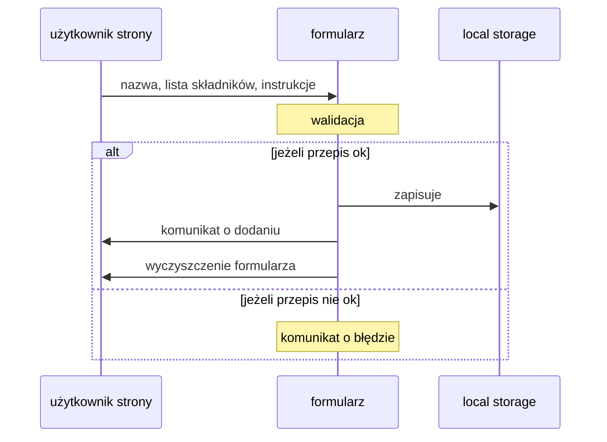

```mermaid

sequenceDiagram

participant u as użytkownik strony
participant f as formularz
participant l as local storage

u ->> f: nazwa, lista składników, instrukcje
note over f: walidacja

alt jeżeli przepis ok
f ->> l: zapisuje
f ->> u: komunikat o dodaniu
f ->> u: wyczyszczenie formularza
else jeżeli przepis nie ok
note over f: komunikat o błędzie

end
```

co do zrobienia:
- walidacja title
- css
- dodawanie instrukcji i wyświetlanie