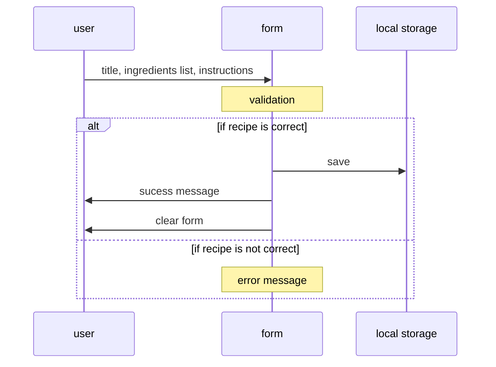

```mermaid

sequenceDiagram

participant u as user
participant f as form
participant l as local storage

u ->> f: title, ingredients list, instructions
note over f: validation

alt if recipe is correct
f ->> l: save
f ->> u: sucess message
f ->> u: clear form
else if recipe is not correct
note over f: error message

end
```

